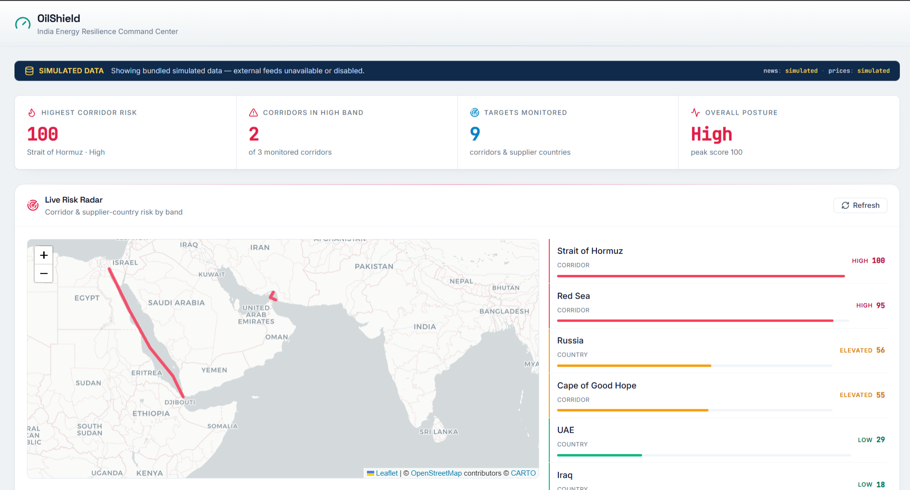
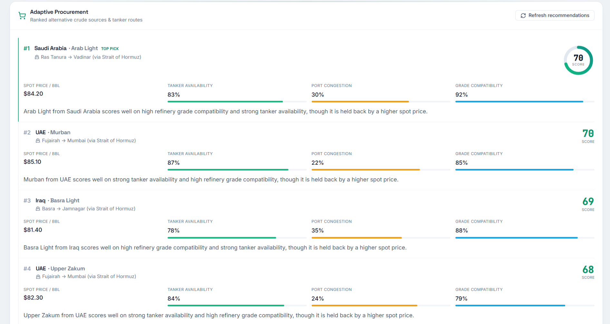
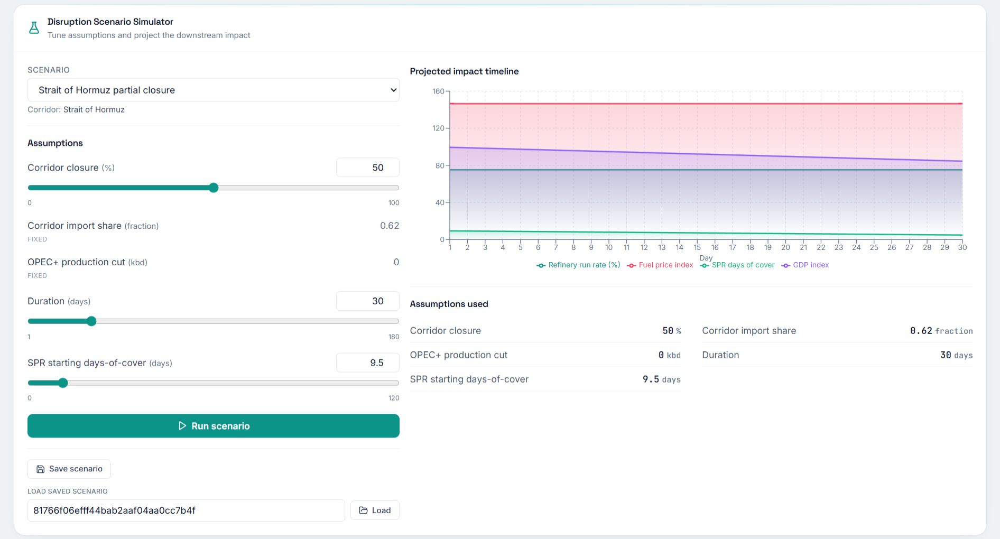
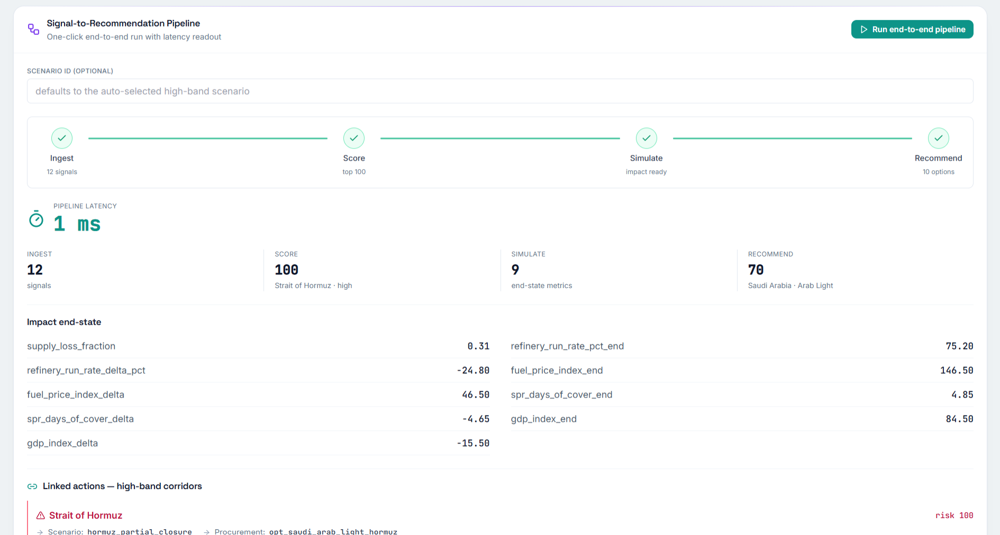
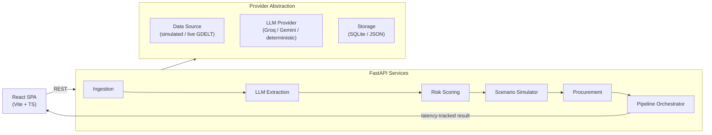

# OilShield — India Energy Resilience Command Center

An AI-driven command center that helps import-dependent economies anticipate, simulate, and respond to oil supply-chain disruptions before they become crises.

> **From crisis firefighting to anticipatory decisions.**

**Problem Statement — PS 2: AI-Driven Energy Supply Chain Resilience for Import-Dependent Economies**

`Status: Backend 46 tests passing` · `Frontend: type-checks & builds clean` · `Data: simulated by default, optional live Groq/Gemini + GDELT` · `Auth/CORS: open (demo mode)`

## Overview

OilShield brings three connected modules into a single operations picture: a **Live Risk Radar** that scores threats to India's crude import corridors, a **Disruption Scenario Simulator** that models the downstream impact of shocks (chokepoint closures, sanctions, weather), and an **Adaptive Procurement Recommender** that proposes hedging and sourcing responses. Tying them together is a **one-click signal→recommendation pipeline** that ingests raw signals, extracts structured events, scores risk, simulates impact, and returns procurement recommendations — while displaying its own end-to-end latency so operators can trust the speed of the decision.

## Screenshots

Drop PNGs into `docs/screenshots/` to populate these previews.






## Architecture



OilShield is built around a **deterministic core with probabilistic edges**: risk scoring, scenario simulation, and procurement math are deterministic and reproducible, so the same inputs always yield the same decision. The probabilistic parts — natural-language signal extraction and live feeds — live at the edges behind a provider abstraction. When live mode is enabled but a provider is unavailable (missing key, rate limit, network error), the system **gracefully degrades from live to simulated** data and from a hosted LLM to the deterministic fallback extractor, so the pipeline always returns a usable answer.

## Tech Stack

**Frontend**
- React + Vite + TypeScript
- TailwindCSS
- Recharts (charts)
- react-leaflet with OSM / CARTO tiles (maps)
- framer-motion (animation)
- lucide-react (icons)

**Backend**
- Python FastAPI + Uvicorn
- Pydantic v2
- httpx (async HTTP)
- SQLite / JSON storage

**AI**
- Groq (primary) and Gemini (secondary) behind an `LLMProvider` abstraction
- Deterministic fallback extractor so the system works with no API keys

## Getting Started

Requirements: Python 3.11+ and Node.js 18+.

### Backend (Windows / PowerShell)

```powershell
cd oilshield\backend
python -m venv .venv
.\.venv\Scripts\Activate.ps1
pip install -e .
uvicorn app.main:app --reload
```

The API runs at `http://localhost:8000`.

### Frontend

```powershell
cd oilshield\frontend
npm install
npm run dev
```

`VITE_API_BASE` defaults to `http://localhost:8000`. Set it in the frontend environment to point at a different backend.

### Live mode (optional)

By default OilShield runs on simulated data with the deterministic extractor — no keys required. To enable live signals and hosted LLM extraction, set the following backend environment variables:

```powershell
$env:DATA_SOURCE_MODE = "live"      # pull live signals (GDELT)
$env:LLM_PROVIDER      = "groq"     # or "gemini"
$env:GROQ_API_KEY      = "..."      # or GEMINI_API_KEY for gemini
```

If a live provider or key is unavailable, OilShield automatically falls back to simulated data and the deterministic extractor.

## Testing

**Backend** — 46 passing tests:

```powershell
cd oilshield\backend
pytest
```

**Frontend** — type-check and production build:

```powershell
cd oilshield\frontend
npm run build
```

## API Endpoints

| Method | Endpoint | Purpose |
| --- | --- | --- |
| POST | `/signals/refresh` | Ingest and refresh the latest raw signals |
| GET | `/risk/scores` | Return current risk scores across targets/corridors |
| GET | `/risk/{target}/signals` | List the signals contributing to a target's risk |
| GET | `/scenarios` | List available disruption scenarios |
| POST | `/scenarios/{id}/run` | Run a scenario and return its simulated impact |
| POST | `/scenarios/save` | Save a scenario configuration |
| GET | `/scenarios/saved/{id}` | Retrieve a previously saved scenario |
| POST | `/procurement/recommend` | Generate adaptive procurement recommendations |
| POST | `/pipeline/run` | Run the full signal→recommendation pipeline (latency-tracked) |
| GET | `/health` | Service health check |

## Project Structure

```
proj-et/
├── oilshield/
│   ├── backend/
│   │   ├── app/
│   │   │   ├── api/         # FastAPI routers (signals, risk, scenarios, procurement, pipeline)
│   │   │   ├── services/    # ingestion, extractor, scoring, simulator, recommender, orchestrator
│   │   │   ├── providers/   # data source, LLM, storage abstractions + factory
│   │   │   ├── models/      # Pydantic v2 schemas
│   │   │   ├── core/        # config, constants, errors
│   │   │   └── data/        # seed JSON (corridors, routes, signals, procurement options)
│   │   └── tests/           # unit + property-based tests
│   └── frontend/
│       └── src/
│           ├── components/  # reusable UI components
│           ├── views/       # module screens (radar, simulator, recommender, pipeline)
│           ├── api/         # API client
│           ├── lib/         # helpers/utilities
│           └── types/       # shared TypeScript types
└── docs/                    # submission and presentation material
```

## Limitations & Roadmap

**Limitations**
- Risk, scenario, and procurement models are illustrative and not yet calibrated to real-world data.
- Simulated data is the default; live feeds are optional and best-effort.
- Auth and CORS are open for demo convenience — not production-safe.

**Roadmap**
- Calibrate scoring and simulation models against historical disruptions.
- Integrate real feeds (AIS vessel tracking, commodity prices, richer news sources).
- Add alerting and notifications on risk-threshold breaches.
- Extend beyond India to multi-country coverage.
- Production hardening: authentication, scoped CORS, rate limiting, observability.

## Documentation

- [Submission overview](docs/SUBMISSION.md)
- [Pitch deck](docs/PITCH_DECK.md)
- [Demo script](docs/DEMO_SCRIPT.md)

---

**OilShield turns an oil shock from a 47-day scramble into a 15-second decision.**
